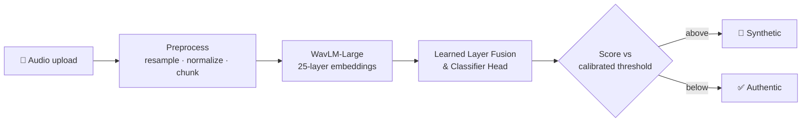

<!-- Top Animated Banner -->

  

  <!-- Animated Typing Header with Space Grotesk -->
  
    

  <!-- Badges -->
  
  
  

---

### 👋 Hey, I'm Cadlee

I build ML systems that ship: from model experiments to a live API that real people can hit. My focus is **audio AI** and **deepfake speech detection**, with enough full-stack engineering to put a real-world product around the model.

- 🎙️ **Flagship Project**: Building **[DeepEcho](https://deepecho.abrdns.com/)** — an end-to-end deepfake speech detection platform with millisecond temporal resolution.
- 🔬 **Exploring**: Self-supervised speech representations (WavLM/HuBERT), learnable layer fusion, threshold calibration, and robustness to unseen neural vocoders.
- ⚡ **Competitive Coding & DSA**: Active practice in **C++** (graphs, dynamic programming, system algorithms).
- 💬 **Ask me about**: Acoustic ML, WavLM embeddings, PyTorch inference optimization, and async FastAPI services.

---

### 🎙️ Flagship: DeepEcho

> Detects AI-synthesized and voice-cloned speech with millisecond-level splice boundary detection, served behind a live web app.

| Specification | Details |
| :--- | :--- |
| **Model** | `WavLM-Large` backbone (317M params) + Learnable Softmax Layer Aggregation + Binary Classification Head |
| **Serving** | Async `FastAPI` (20.05ms temporal hop; frame-level boundary localization) |
| **Benchmark** | In-The-Wild dataset (31,779 clips) & MLAAD multi-generator testbed |
| **Results** | **8.02% EER** on In-The-Wild · **0.9825 F1-Score** on MLAAD held-out |
| **Links** | 🌐 **[Live Demo](https://deepecho.abrdns.com/)** · 💻 **[Source Code](https://github.com/cadleedsouzaa/DeepEcho---Deep-Fake-Audio-Detection)** |

---

### 🧰 Other Builds

| Project | What It Is | Stack |
| :--- | :--- | :--- |
| **[DealRoom](https://github.com/cadleedsouzaa/DealRoom)** | Real-time deal negotiation and collaboration workspace | Next.js · TypeScript |
| **[PolicyGate](https://github.com/cadleedsouzaa/PolicyGate)** | Automated policy compliance auditing and access verification engine | Python · Security |
| **[CultureVerse](https://github.com/cadleedsouzaa/cultureverse-final)** | Interactive cultural heritage discovery and exploration platform | React · TypeScript |
| **[MGD Noise Removal](https://github.com/cadleedsouzaa/Salt-Pepper-Noise-Removal-Using-MGD)** | Impulse noise reduction preserving sharp edge boundaries via Modified Gradient Descent | Python · OpenCV · NumPy |
| **[PlacementTraining](https://github.com/cadleedsouzaa/PlacementTraining)** | Data structures & algorithm implementations: graphs, DP, competitive programming | C++ |

---

### 🛠️ Stack

  
<strong>ML & Audio AI</strong>

  

  
<strong>Backend & Web</strong>

  

  
<strong>Systems & Tools</strong>

  

---

### 📊 Activity

  <picture>
    <source media="(prefers-color-scheme: dark)" srcset="https://github-readme-stats.vercel.app/api?username=cadleedsouzaa&show_icons=true&theme=tokyonight&hide_border=true&bg_color=0d1117" />
    
  </picture>
  <picture>
    <source media="(prefers-color-scheme: dark)" srcset="https://streak-stats.demolab.com/?user=cadleedsouzaa&theme=tokyonight&hide_border=true&background=0d1117" />
    
  </picture>

  <!-- Optional: contribution snake. Set up Platane/snk Action, then uncomment:
  
  -->

 

  Open to ML / audio-AI collaborations and engineering roles · reach me on <a href="https://www.linkedin.com/in/cadlee-dsouza/">LinkedIn</a>
    
  

