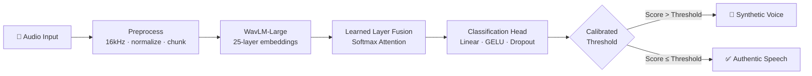

<!-- Top Animated Banner -->

  

  <!-- Animated Typing Header (Space Grotesk - Perfectly Centered, Zero Clipping) -->
  
    

  <!-- Badges (Cleanly linked without underline artifacts) -->
  &nbsp;&nbsp;

---

### 👋 Hey, I'm Cadlee

I build ML systems that ship: from model research to high-throughput, low-latency live APIs. My specialization is **audio AI** and **deepfake speech forensics**, backed by strong full-stack engineering to build complete products around models.

- 🎙️ **Flagship**: Creator of **[DeepEcho](https://deepecho.abrdns.com/)** — live forensic platform detecting synthetic, cloned, and spliced speech at 20ms frame resolution.
- 🔬 **Research Focus**: Self-supervised speech representations (`WavLM-Large`), learnable layer-wise softmax aggregation, and vocoder artifact analysis.
- ⚡ **Algorithmic Practice**: Actively solving complex algorithmic problems in **C++** (graphs, dynamic programming, system optimization).
- 💬 **Ask me about**: Acoustic feature extraction, WavLM embeddings, PyTorch inference optimization, and async FastAPI microservices.

---

### 🎙️ Flagship Architecture: DeepEcho

> Real-time acoustic intelligence platform identifying synthesized, cloned, and spliced speech with millisecond-level splice boundary detection (20.05ms frame hop).

| Benchmark Metric | In-The-Wild (31,779 clips) | MLAAD Multi-Generator Testbed |
| :--- | :--- | :--- |
| **Performance** | **8.02% EER** (Equal Error Rate) | **0.9825 F1-Score** |
| **Resolution** | **20.05ms frame hop** (detects exact splice boundaries) | Evaluated across 39 generative voice engines |
| **Links** | 🌐 **[Live Web App](https://deepecho.abrdns.com/)** | 💻 **[GitHub Repository](https://github.com/cadleedsouzaa/DeepEcho---Deep-Fake-Audio-Detection)** |

---

### 🌟 Featured Projects Portfolio

<table align="center" width="100%">
  <thead>
    <tr>
      <th width="32%">Project</th>
      <th width="48%">Description</th>
      <th width="20%">Stack & Links</th>
    </tr>
  </thead>
  <tbody>
    <tr>
      <td>
        <b>🎙️ <a href="https://deepecho.abrdns.com">DeepEcho</a></b>
         
        <i>Deepfake Audio Detection</i>
         
        ● LIVE IN PRODUCTION
      </td>
      <td>
        Forensic audio intelligence platform detecting synthetic speech and voice clones. Analyzes acoustic spectrograms and 25 WavLM transformer layers with 20ms boundary resolution.
      </td>
      <td>
        
         
        
         
        <code>Python</code> <code>PyTorch</code> <code>WavLM</code>
      </td>
    </tr>
    <tr>
      <td>
        <b>🛡️ <a href="https://github.com/cadleedsouzaa/PolicyGate">PolicyGate</a></b>
         
        <i>Automated Governance & Auditing</i>
      </td>
      <td>
        Policy enforcement and access compliance framework designed to audit configurations, detect compliance drift, and enforce organizational rules automatically.
      </td>
      <td>
        
         
        <code>Python</code> <code>Automation</code> <code>Security</code>
      </td>
    </tr>
    <tr>
      <td>
        <b>💼 <a href="https://github.com/cadleedsouzaa/DealRoom">DealRoom</a></b>
         
        <i>Deal Negotiation & Collaboration Hub</i>
      </td>
      <td>
        Full-stack digital workspace providing structured negotiation pipelines, document handling, and real-time collaboration workflows.
      </td>
      <td>
        
         
        <code>Next.js</code> <code>TypeScript</code> <code>Tailwind</code>
      </td>
    </tr>
    <tr>
      <td>
        <b>🖼️ <a href="https://github.com/cadleedsouzaa/Salt-Pepper-Noise-Removal-Using-MGD">Noise Removal (MGD)</a></b>
         
        <i>Digital Image Processing</i>
      </td>
      <td>
        Impulse noise reduction algorithm utilizing Modified Gradient Descent (MGD) optimization for high-fidelity image restoration while preserving sharp edge boundaries.
      </td>
      <td>
        
         
        <code>Python</code> <code>OpenCV</code> <code>NumPy</code>
      </td>
    </tr>
    <tr>
      <td>
        <b>🏛️ <a href="https://github.com/cadleedsouzaa/cultureverse-final">CultureVerse</a></b>
         
        <i>Interactive Cultural Discovery</i>
      </td>
      <td>
        Interactive web application designed to explore global traditions, historical artifacts, and cultural heritage through an intuitive, modern responsive interface.
      </td>
      <td>
        
         
        <code>TypeScript</code> <code>React</code>
      </td>
    </tr>
    <tr>
      <td>
        <b>⚡ <a href="https://github.com/cadleedsouzaa/PlacementTraining">Algorithmic Engineering</a></b>
         
        <i>DSA & System Optimization</i>
      </td>
      <td>
        Optimized implementations of core data structures, dynamic programming paradigms, graph traversal algorithms, and competitive programming patterns in C++.
      </td>
      <td>
        
         
        <code>C++</code> <code>DSA</code> <code>Algorithms</code>
      </td>
    </tr>
  </tbody>
</table>

---

### 🛠️ Tech Stack & Arsenal

  
<strong>ML & Audio AI</strong>

  

  
<strong>Backend & Full-Stack</strong>

  

  
<strong>Systems & Tools</strong>

  

---

### 📊 GitHub Activity & Analytics

  <picture>
    <source media="(prefers-color-scheme: dark)" srcset="https://github-readme-stats.vercel.app/api?username=cadleedsouzaa&show_icons=true&theme=tokyonight&hide_border=true&bg_color=0d1117" />
    
  </picture>
  <picture>
    <source media="(prefers-color-scheme: dark)" srcset="https://streak-stats.demolab.com/?user=cadleedsouzaa&theme=tokyonight&hide_border=true&background=0d1117" />
    
  </picture>

 

  Open to ML / audio-AI collaborations and engineering roles · reach me on <a href="https://www.linkedin.com/in/cadlee-dsouza/">LinkedIn</a>
    
  

